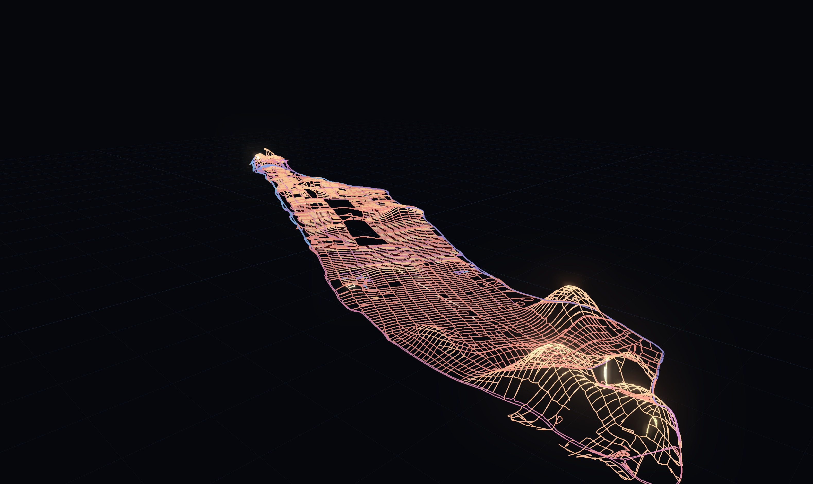
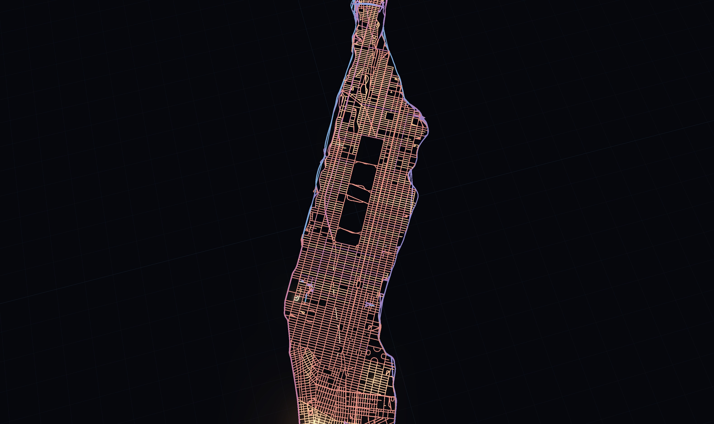
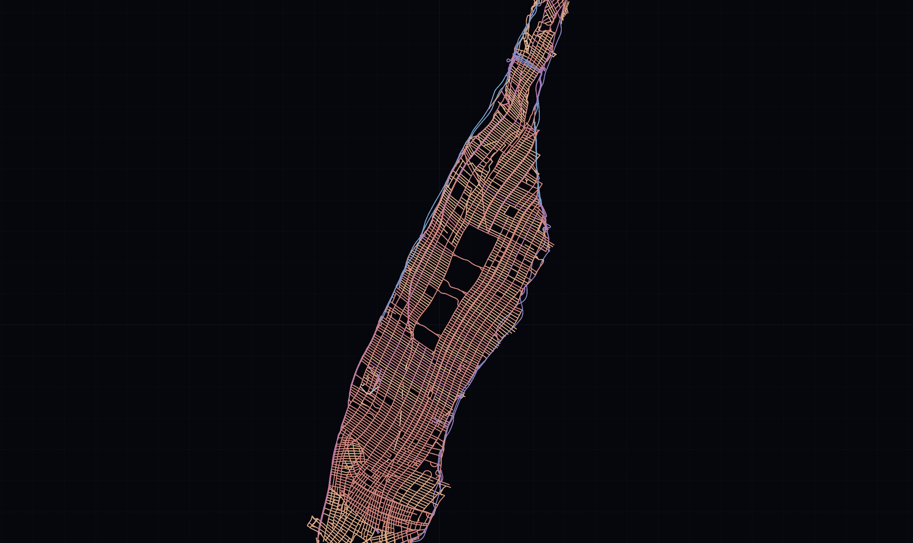
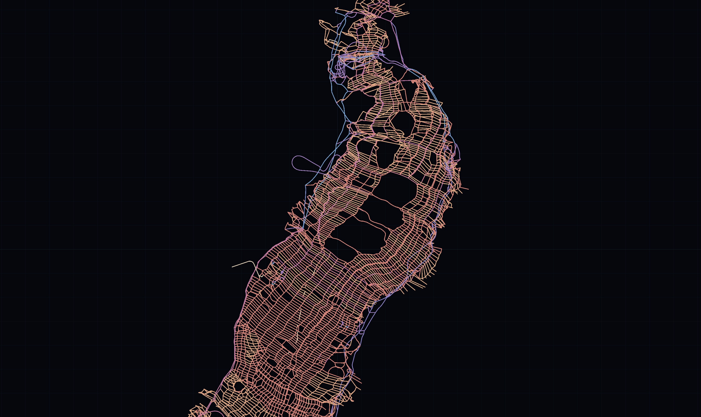

# Elastic Street Network

A real city's street network, warped by how fast you can drive each street, pushed into 3D.
Fast roads contract toward nothing and pin themselves to the ground as valleys; slow streets
keep their length, and where the plane can't hold it the surface rises — neighborhoods bulge
into hills shaped by how far they are from fast movement.

**v1 (this repo): Manhattan, static, warped by free-flow speed.**


*Warped: Washington Heights peaks at the north end; the Lower East Side and Chinatown swell in
the foreground; the FDR and West Side Highway trace flat valleys along the rivers.*


*The same data at warp 0 — the undeformed map, colored by free-flow speed.*

## Run it

```bash
uv venv --python 3.12 .venv
uv pip install --python .venv/bin/python osmnx scipy numpy

.venv/bin/python scripts/fetch_graph.py   # OSM download (Manhattan Island, drive network)
.venv/bin/python scripts/relax.py         # warp + embed -> data/network.json (~45 s)

python3 -m http.server 8741               # from the repo root
# open http://localhost:8741/viewer/index.html
```

Viewer controls: drag to orbit, scroll to zoom. **warp** morphs flat ↔ warped, **height ×**
exaggerates relief, **bloom** adjusts glow.

## How it works

**The metric.** Each street's target ("rest") length is its geographic length ×
`(v_ref / v)^alpha`, with `v` the street's free-flow speed (OSM `maxspeed`, with NYC-tuned
fallbacks by road class). `v_ref` defaults to 40 kph — Manhattan's modal 25 mph grid street —
so ordinary streets keep their length, arterials and highways contract (a 90 kph parkway wants
to be ~27 % of its map length), and slow residential pockets want to *grow*.

**Phase A — in-plane contraction.** Relax xy with springs at `min(rest, geo)` (contraction
only), a kNN "city fabric" that couples nearby points' displacements so the deformation stays
smooth, and a weak anchor to the real map for recognizability. The fast corridors pull the
footprint inward (~290 m mean displacement).

**Phase B — height.** Freeze xy. Each segment now has a required grade
`s = sqrt(rest² − Lxy²) / Lxy` — the slope that would make its 3D arc length match its rest
length (zero where the plane already holds it). The height field is the **slope-limited
distance transform**: the height you reach climbing from the wants-to-stay-flat set, using
every street as a ramp at its grade (multi-source Dijkstra, edge cost `s × length`), projected
onto a ~120 m grid and lightly smoothed. Neighborhoods far from fast roads rise; fast corridors
stay pinned at zero.

### Why not a true elastic energy minimum?

Tried first, and it fails in an instructive way. The warped metric concentrates excess length
at block scale (slow streets interleaved with neutral ones), so a genuine 3D elastic relaxation
either crumples every street into independent block-scale wrinkles — physically correct, reads
as fuzz — or, with any meaningful smoothness energy, finds flat-with-residual-strain cheaper
than coherent hills. The distance transform is the legible upper envelope of the same quantity:
*how much length the plane fails to hold, and how far from relief you are*. The solver prints
fidelity stats (realized vs. target length per class) so the compromise is measured, not hidden:
contracting roads end ~36 % shorter than the map (anchored well above their tiny targets),
growing streets realize ~76 % of their target length.

## 2D variants

Two flat (z = 0) formulations that move only the **intersections** — interior street geometry
is carried along by a per-edge similarity transform, so a street cannot absorb surplus length
by wiggling on its own.

**`scripts/relax2d.py` — edge-length cartogram.** Minimize relative MSE between each street's
drawn chord and `chord × c / v` (drawn length ∝ travel time; the scale `c` is fit by least
squares so the typical street keeps its length). A collinearity term keeps streets straight
*through* intersections — without it the grid absorbs surplus as one-block herringbone shear;
with it, streets act as stiff rods and the deformation surfaces as neighborhood-scale waves.
Fits well (realized/target quartiles ≈ 0.93/0.99/1.04) and stays recognizable.

```bash
.venv/bin/python scripts/relax2d.py
# open http://localhost:8741/viewer/index.html?data=network2d.json
```



**`scripts/mds2d.py` — travel-time MDS.** Position nodes so Euclidean distance ≈ network
travel time between sampled pairs (400 landmarks × all nodes). This encodes *reachability*:
places linked by fast roads pull together even when every street between them is slow. More
dramatic, less readable — highways loop outside the island because their endpoints want to be
near while the road itself becomes a redundant detour.

```bash
.venv/bin/python scripts/mds2d.py
# open http://localhost:8741/viewer/index.html?data=network_mds.json
```



## v2 — Breathing Manhattan (animated day)

`scripts/animate_mds.py` + `viewer/day.html`. The travel-time MDS, solved once per hour from
observed weekday speeds (NYC Uber Movement 2019 via the
[tracebase](https://github.com/xinychen/tracebase) mirror; segment × hour matrix joined to
graph edges by OSM way id, free-flow fallback where unobserved — unobserved streets are drawn
faded). The city expands as congestion stretches travel times at rush hour and contracts
overnight.

What makes the breathing honest and the animation smooth:

- **One global scale** (m per second of travel time) fit across all 24 hours pooled.
  Refitting per hour would normalize the expansion away.
- **Warm starts**: each hour's solve starts from the previous hour's layout (same landmarks,
  same anchor), run for two passes so the 23:00 → 00:00 wraparound is seamless. Consecutive
  frames differ only where speeds differ.
- The viewer lerps node positions between hourly layouts and carries street geometry along
  with per-edge similarity transforms; color = observed/free-flow speed (red = crawling).

```bash
# data (once): road.csv + January matrix from tracebase into data/
.venv/bin/python scripts/animate_mds.py   # ~24 solves, several minutes
# open http://localhost:8741/viewer/day.html  (play button animates the day)
.venv/bin/python scripts/render_base.py   # cache map-only frames (~8 min, once)
.venv/bin/python scripts/compose_video.py  # overlay + encode (~10 s per iteration)
```


Numbers from January 2019 weekdays: network mean observed speed swings 35.5 kph (03:00) to
22.2 kph (17:00); the layout breathes from −16 % (04:00) to +22 % (17:00) linear scale vs the
geographic map. Coverage: 5,391 of 8,060 edges have observed profiles; unobserved edge-hours
are imputed from the congestion ratio of their 8 nearest observed edges (spatially local, so
a gap in midtown crawls like midtown) and drawn faded in the viewer. Colors are relative to
each edge's own fastest hour — Uber speeds include lights and stops, so posted-limit
"free flow" is never reached and would tint even 4 AM orange. The 20-minute yardstick is
calibrated against the layouts themselves (`scripts/calibrate_yard.py`): the median layout
distance between node pairs whose true network travel time is 18–22 min, per hour.

## Layout

```
scripts/fetch_graph.py     OSM download + free-flow speed tagging (any place)
scripts/relax.py           3D: warp metric + Phase A + Phase B -> data/network.json
scripts/relax2d.py         2D edge-length cartogram -> data/network2d.json
scripts/mds2d.py           2D travel-time MDS -> data/network_mds.json
scripts/animate_mds.py     24-hour solve (--planar adds a foldover barrier)
scripts/calibrate_yard.py  empirical yardstick calibration vs the layouts
scripts/amplify_breathing.py  hour-dependent calibration (see below)
scripts/render_base.py     expensive layer: map-only frame cache
scripts/compose_video.py   fast layer: overlay (LAYOUT dict in px) + encode
scripts/validate_times.py  sanity-check travel times against public OSRM
viewer/index.html          three.js viewer (fat lines, bloom, morph slider)
viewer/day.html            interactive day animation
data/                      day_mds*.json included; raw inputs regenerable
shots/                     final videos + stills

Other cities: the pipeline is city-agnostic given hourly segment speeds.
Seattle (same tracebase mirror, identical format) is included:
breathing_seattle.mp4. Travel-time levels are calibrated against the public
OSRM router (the raw graph runs fast — no intersection penalties): the
10-minute yardstick is scaled by 1.37x (Manhattan) / 1.52x (Seattle).
```

### Hour-dependent calibration (breathing_amp / breathing_seattle_amp)

The constant calibration is right off-peak but understates rush hour:
checked against Google Maps depart-at estimates, the needed factor grows
from 1.77x (4 AM) to 2.37x (5 PM) in Manhattan and 1.62x to 2.26x in
Seattle — Google's typical 5 PM trip takes ~2x its 4 AM time, while the
2019 Uber speeds swell only ~1.5x (graph routing misses intersection
delay, which itself peaks with traffic). `scripts/amplify_breathing.py`
scales each hour's layout about its centroid by `cal(h)/cal(4 AM)`, with
`cal(h)` interpolated between those anchors along the layout's own
congestion scale. Linear breathing span roughly doubles (43% → ~95%), and
the yardstick becomes exact at every hour instead of a daily mean. The
`_amp` videos are composed from `day_mds_amp.json` /
`day_mds_seattle_amp.json` with the 4 AM anchor as the yardstick scale.
