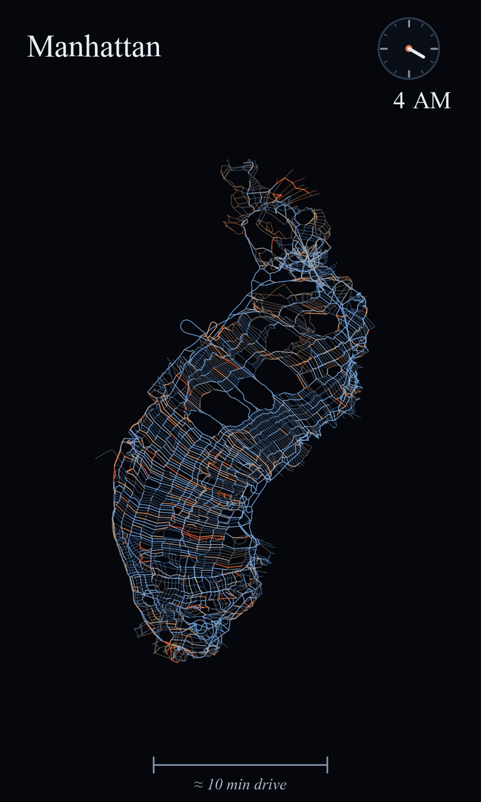

# Elastic Streets

Cities that breathe: street maps where **distance = drive time**, animated
over 24 hours. The city swells at rush hour and contracts at night.



Every node of the street network is positioned so that the Euclidean distance
between any two points matches the time it takes to drive between them at that
hour. Fast freeways pull distant places together; congestion pushes the whole
fabric apart. Solved once per hour from real speed data, splined into a
seamless 9-second loop: portrait 1080×1800, 48 fps, analog clock, and a
calibrated "≈ 10 min drive" yardstick.

Videos in [`shots/`](shots/): Manhattan and Seattle (2019 Uber Movement
speeds), Los Angeles (Mapbox typical-traffic sampling), plus `_amp` variants
with rush hour amplified to match real-world congestion levels.

## Reproduce it

The solved layouts for Manhattan, Seattle, and Los Angeles are committed, so
rebuilding any of the videos is two commands and zero data downloads:

```bash
uv venv --python 3.12 .venv
uv pip install --python .venv/bin/python osmnx scipy numpy matplotlib pillow pyproj
# also: ffmpeg on PATH

.venv/bin/python scripts/render_base.py data/day_mds_amp.json _amp   # ~10 min, cached
.venv/bin/python scripts/compose_video.py _amp Manhattan 1.77        # ~30 s
open shots/breathing_amp.mp4
```

Every city/variant is one row of the table in [CLAUDE.md](CLAUDE.md) — which
also means you can just open [Claude Code](https://claude.com/claude-code) in
this directory and ask: *"rebuild the Seattle animation"* or *"re-solve
Manhattan from the raw Uber data"* or *"do this for Chicago"*. CLAUDE.md
teaches the session the whole pipeline, including re-solving from scratch
(`scripts/fetch_data.sh` pulls the 2019 Uber Movement speed matrices) and
extending to arbitrary cities via the Mapbox typical-traffic sampler.

There's also an interactive viewer:
`python3 -m http.server 8741` from the repo root, then
`http://localhost:8741/viewer/day.html` (`?data=day_mds_seattle.json` etc.).

## How it works

**The layout.** Per hour, a travel-time MDS: minimize the relative stress
between Euclidean distances and network drive times over 400 landmarks × all
nodes (Manhattan: 4.5k intersections; streets carry their geometry along by
per-edge similarity transforms). Honesty and smoothness come from three
choices:

- **One global scale** (meters per second of travel time) fit across all 24
  hours pooled. Refitting per hour would normalize the breathing away.
- **Warm starts × 2 passes**: each hour starts from the previous hour's
  layout, and the day is solved twice so the 23:00 → 00:00 wraparound is
  seamless. Consecutive frames differ only where speeds differ.
- **A similarity-invariant anchor** to the geographic map for
  recognizability — it penalizes shape distortion but exerts zero force
  against uniform expansion, so the breathing is set purely by the data.

Animation is a cyclic Catmull-Rom spline through the 24 keyframes — positions,
colors, and observation-fade alpha all splined the same way.

**The data (Manhattan, Seattle).** NYC and Seattle Uber Movement 2019 street
speeds via the [tracebase](https://github.com/xinychen/tracebase) mirror:
per-segment × hourly observed speeds, January weekdays averaged, joined to the
OSM graph by way id. Coverage is 67% / 24% of edges; unobserved edge-hours get
the inverse-distance-weighted congestion ratio of their 8 nearest observed
edges (a gap in midtown crawls like midtown) and render slightly faded.
Colors are each street's current speed relative to its own fastest hour —
Uber speeds include lights and stops, so posted-limit "free flow" is never
reached and would tint even 4 AM orange.

**The data (any other city).** Uber street speeds only ever covered a handful
of cities. For everywhere else (`shots/breathing_la.mp4`): a **sparse anchor
grid** queried against Mapbox's `driving-traffic` profile with `depart_at` —
predicted typical traffic for any hour, any city, free tier covers a city
(~30k requests for greater LA). Freeway anchors chained every ~3 km along
motorways carry the fast skeleton (without them, path sums err +30–90% on
long trips; with them ~10% median vs direct routes). Only graph *edges* are
queried; a per-hour endpoint offset (~3–4 min, fit each hour against direct
long-range checks) corrects per-leg overhead, Dijkstra supplies the dense
matrix, and every intersection is then solved by the same MDS with the
corridors acting as the speed sensor. LA breathes **−40% (3 AM) to +39%
(4 PM)** straight from the data.

**Calibration.** Raw shortest-path times run fast — no intersection or turn
penalties. Validated against OSRM and Google Maps depart-at estimates: the
yardstick is scaled 1.37× (Manhattan) / 1.52× (Seattle); LA needs 1.0 because
Mapbox times are already calibrated. The `_amp` variants go further: Google's
typical 5 PM trip takes ~2× its 4 AM time, while 2019 Uber speeds swell only
~1.5×, so `amplify_breathing.py` scales each hour's layout by an
hour-dependent calibration (interpolated between measured 4 AM / 5 PM
anchors), roughly doubling the breathing span and making the yardstick exact
at every hour.

## Layout

```
scripts/fetch_graph.py        OSM download + free-flow speed tagging
scripts/fetch_data.sh         2019 Uber Movement matrices (tracebase)
scripts/animate_mds.py        24-hour MDS solve (--planar: foldover barrier)
scripts/calibrate_yard.py     empirical yardstick calibration
scripts/amplify_breathing.py  hour-dependent rush-hour amplification
scripts/anchor_probe.py       validate the anchor-grid concept on a slice
scripts/anchor_pull.py        24h Mapbox typical-traffic pull (any city)
scripts/anchor_layout.py      anchor MDS + IDW street warp (fast preview)
scripts/anchor_layout_full.py per-intersection MDS from corridor speeds
scripts/validate_times*.py    sanity checks vs public OSRM
scripts/render_base.py        expensive layer: map-only frame cache
scripts/compose_video.py      fast layer: overlay (LAYOUT dict) + encode
viewer/day.html               interactive day animation
data/                         solved day_mds*.json committed; raw regenerable
shots/                        final videos + stills
```
